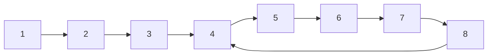

#linkedList 
#twoPointers

[[Floyd's tortise and hare]] algorithm is used here.



Let the length from start to node where cycle starts be $x$. Here $x = 3$
Let the length from node where cycle starts to node where slow and fast pointer meet be $y$. Here $y = 2$.
Let length of cycle be $c$

Slow pointer transverse $x + y$
Fast pointer transverse $x + y + c$ but it travels twice as much of slow point
$x + y + c = 2(x + y)$
$\therefore x + y = c$


## Finding where cycle starts
Slow pointer has covered y from start of cycle and it needs to cover x more to reach start. To make it move x and x is the distance from head to start of cycle.
So, a new pointer and slow can be moved together to cover x, they while reach start of cycle node together.


## Code
```kotlin
fun cycle(head: ListNode?): ListNode? {
	var fast = head
	var slow = head
	//
	while (fast?.next != null) {
		fast = fast?.next?.next
		slow = slow?.next
		//
		if (fast == slow) {
			// found that cycle exists
			// y distance from start
		}
	}
	//
	if (fast?.next == null) {
		// cycle do not exist don't continue
	}
	// new pointer to move x from start to reach start of cycle
	var start = head
	// start and slow will meet at start of cycle
	while (start != slow) {
		start = temp?.next
		slow = slow?.next
	}
	return start
}
```
