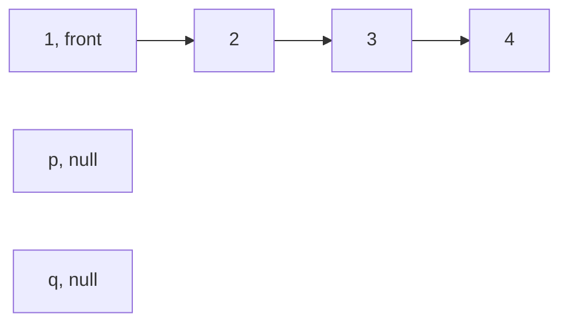
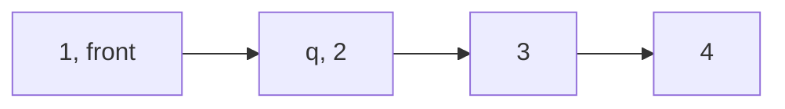
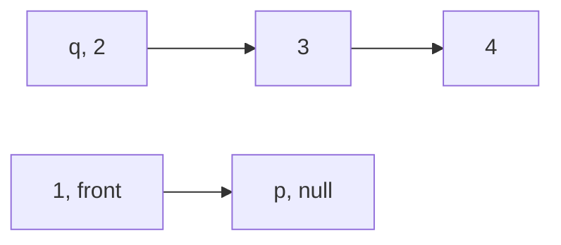
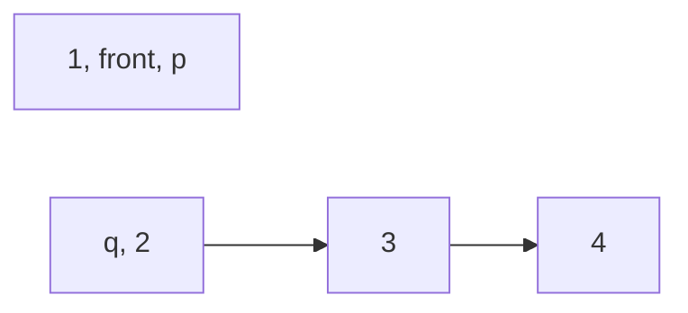
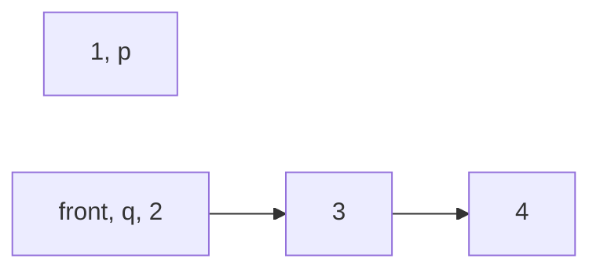

#linkedList 
- Create a null pointer (p) to which nodes starting from head will be pointed. Keep moving this pointer to the newest node added.
- Another pointer (q) will point to head.next to keep reference of old list so that head can be removed and added to new list.
- Terminate when head of original list becomes null.
> We are removing head from original list and adding it to new list and then making next node of original list as head. This is repeated untill nothing is left in original list.

```kotlin
fun reverseList(head: ListNode?): ListNode? {
	var front = head
	var p: ListNode? = null
	var q: ListNode? = null
	//
	while (front != null) {
		q = front?.next    
		front?.next = p    
		p = front    
		front = q    
	}
	//
	return p
}
```


Initial



 1. `q = front?.next`



2. `front?.next = p`



3. `p = front`



4. `front = q`



